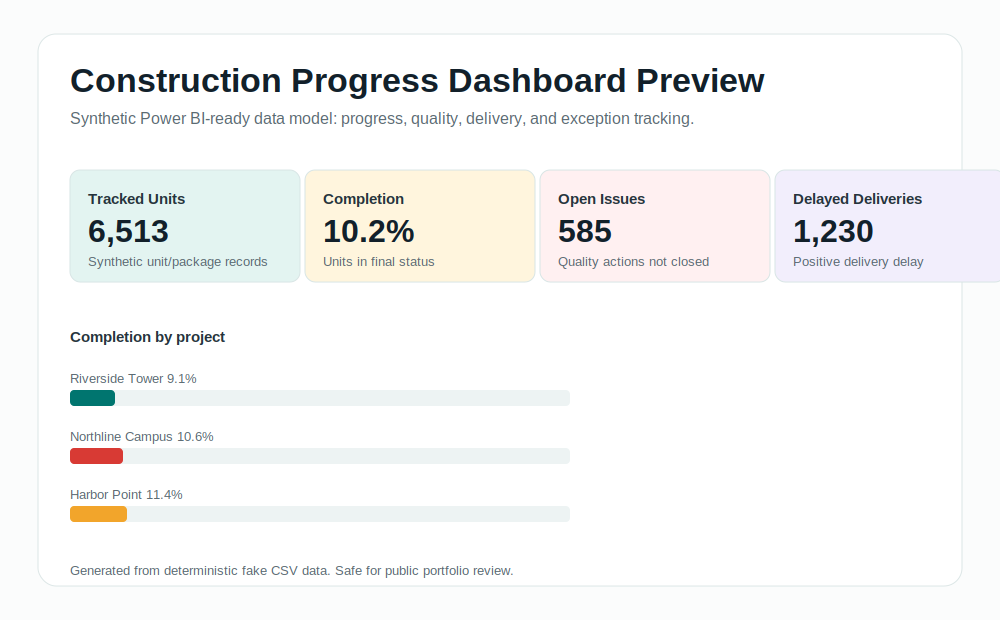
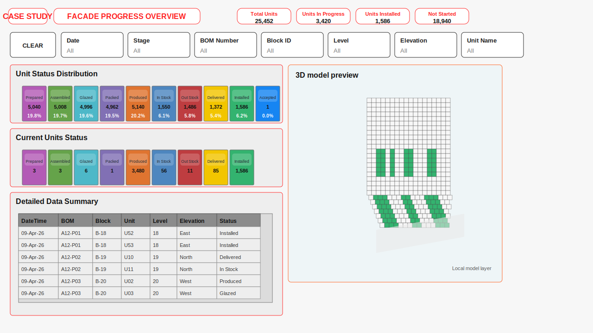

# Construction Progress Dashboard Case Study

This repository is a public, portfolio-safe Power BI case study built with synthetic representative data. It does not contain any real company names, client names, API endpoints, BIM identifiers, screenshots, operational records, employer assets, or confidential implementation details.

The project generates a realistic construction-progress style dataset as CSV files that can be imported into Power BI Desktop to build a dashboard covering progress tracking, plan vs actual performance, quality issues, and deliveries.



## Reviewer Value

This repo is designed to show the analyst workflow behind a construction progress dashboard:

- convert operational event history into reporting-ready fact and dimension tables
- define latest-status and plan-vs-actual KPI logic
- document Power BI page design and DAX measure patterns
- validate outputs before stakeholder handover
- communicate confidential production experience through generated data only

The value is not the sample data itself; the value is the repeatable reporting approach, semantic model, validation checks, and dashboard thinking.

## Facade Dashboard Case Study

The repo also includes a synthetic facade-progress case study based on the same type of reporting pattern I use for model-linked construction analytics.



It demonstrates:

- facade unit status workflow tracking
- current vs historical status reporting
- block, level, stage, elevation, and unit filters
- issue category and issue timeline reporting
- 3D model-linked reporting concepts using public-safe synthetic model keys

The original professional dashboard cannot be shared publicly, so this repo uses generated data and generated visuals only.

## Portfolio Safety

Everything in this repository is generated from scratch for public portfolio review.

It does not include:

- Employer or customer-owned operational records
- Real project names or IDs
- Real API URLs or internal paths
- Real BIM or model file references
- Real PBIX, PBIP, screenshots, or production extracts
- Employer-owned source code or confidential structures

## Repository Structure

```text
construction-progress-dashboard/
├── README.md
├── data/
│   ├── dim_project.csv
│   ├── dim_building.csv
│   ├── dim_level.csv
│   ├── dim_zone.csv
│   ├── dim_unit.csv
│   ├── dim_status.csv
│   ├── dim_discipline.csv
│   ├── dim_contractor.csv
│   ├── fact_unit_status_history.csv
│   ├── fact_unit_plan.csv
│   ├── fact_quality_issues.csv
│   └── fact_deliveries.csv
├── docs/
│   ├── data-model.md
│   ├── dashboard-pages.md
│   └── dax-measures.md
└── scripts/
    └── generate_synthetic_data.py
```

## What It Demonstrates

- Synthetic data generation with deterministic output
- Star-schema modeling for Power BI
- Construction-style operational progress tracking
- Unit status history and latest-status reporting
- Plan vs actual analysis
- Quality issue monitoring
- Delivery and logistics analysis

## Quick Start

Run the generator from the repository root:

```bash
python scripts/generate_synthetic_data.py
```

The script writes all CSV files into `data/` and prints row counts after generation.

Generate the reviewer-friendly KPI proof pack:

```bash
python scripts/build_dashboard_preview.py
python scripts/build_facade_case_study.py
```

This writes:

- `data/reporting_kpis.csv`
- `docs/kpi-proof-summary.md`
- `assets/dashboard-preview.svg`
- `data/facade_status_workflow_summary.csv`
- `data/facade_current_status_snapshot.csv`
- `docs/facade-dashboard-case-study.md`
- `assets/facade-progress-preview.svg`
- `assets/facade-issues-preview.svg`

## Recommended Power BI Flow

1. Import all CSV files from `data/`.
2. Create relationships described in [docs/data-model.md](./docs/data-model.md).
3. Add the measures from [docs/dax-measures.md](./docs/dax-measures.md).
4. Build the report pages outlined in [docs/dashboard-pages.md](./docs/dashboard-pages.md).

## Proof for Reviewers

- [KPI proof summary](./docs/kpi-proof-summary.md): generated headline metrics and project completion summary.
- [Dashboard preview SVG](./assets/dashboard-preview.svg): static visual preview created from the synthetic CSV outputs.
- [Facade dashboard case study](./docs/facade-dashboard-case-study.md): synthetic reconstruction of a model-linked facade progress workflow.
- [Facade Power BI architecture](./docs/facade-powerbi-architecture.md): generic semantic model and report-page design pattern.
- [Data model](./docs/data-model.md): star-schema relationships suitable for Power BI.

## Example Reporting Questions

- How many units are complete, installed, blocked, or in rework?
- Which buildings, levels, or zones are lagging the plan?
- Which contractors have the highest issue volume?
- How many deliveries are delayed?
- Where should project teams focus next?

## Regeneration

The generator uses a deterministic seed, so rerunning it reproduces the same dataset structure and values unless the script is intentionally changed.

## License

This project is intended for learning, portfolio use, and experimentation with synthetic data.
